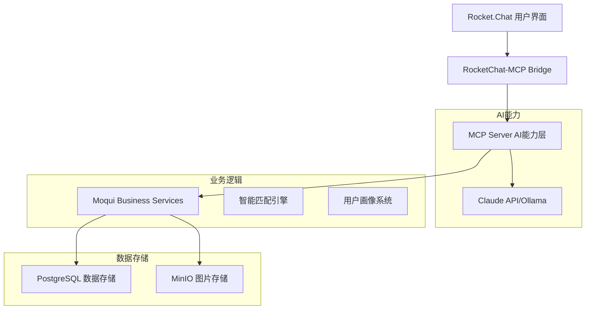
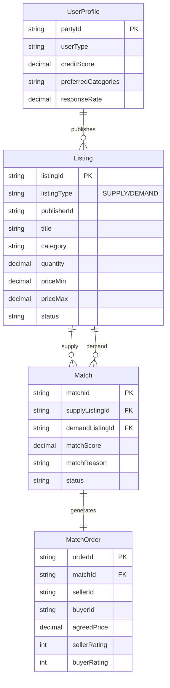

# Moqui Marketplace - AI驱动的社区商业撮合平台
### 项目推进方案与技术培训

---

## 📋 目录

1. [项目概述](#项目概述)
2. [核心架构](#核心架构)
3. [技术实现](#技术实现)
4. [开发进展](#开发进展)
5. [部署策略](#部署策略)
6. [下一步计划](#下一步计划)

---

## 1. 项目概述 {#项目概述}

### 🎯 项目定位
**AI Agent驱动的社区商业撮合平台**

- **用户体验**: 像聊天一样完成所有操作
- **智能匹配**: AI基于多维度推荐最优供需关系
- **轻量运营**: 只做撮合，不涉及支付和物流
- **数据驱动**: 用户画像越来越精准

### 🏘️ 目标场景
```
地理范围: 1-2公里社区范围
目标用户: 线下实体店（菜市场商家、肉铺、水果店）
核心品类: 生鲜食材（蔬菜、肉类、水果、海鲜）
```

### 💡 核心价值主张
1. **零学习成本** - 自然语言交互
2. **智能推荐** - AI理解需求并匹配
3. **提升效率** - 减少无效沟通
4. **降低风险** - 平台不涉及资金流

---

## 2. 核心架构 {#核心架构}

### 📊 整体架构图



### 🔧 技术栈选择

| 层级 | 技术选型 | 理由 |
|------|----------|------|
| **用户界面** | Rocket.Chat | 成熟的聊天平台，支持Bot集成 |
| **AI集成** | MCP (Model Context Protocol) | 标准化AI-应用集成协议 |
| **AI模型** | Claude 3.5 Sonnet | 最强对话理解和工具调用能力 |
| **后端框架** | Moqui Framework (Java 21) | 企业级框架，完善的实体管理 |
| **构建工具** | Gradle 8.10 | 现代化构建系统 |
| **数据库** | PostgreSQL | 可靠的关系型数据库 |
| **图片存储** | MinIO | 兼容S3的对象存储 |

---

## 3. 技术实现 {#技术实现}

### 🗃️ 数据模型设计

#### 核心实体关系



#### 智能标签体系

```
品类标签 (CATEGORY):
├── 蔬菜 (CAT_VEGETABLE)
│   ├── 叶菜类 (CAT_VEG_LEAF)
│   ├── 根茎类 (CAT_VEG_ROOT)
│   └── 瓜果类 (CAT_VEG_FRUIT)
├── 肉类 (CAT_MEAT)
│   ├── 猪肉 (CAT_MEAT_PORK)
│   ├── 牛肉 (CAT_MEAT_BEEF)
│   └── 禽类 (CAT_MEAT_POULTRY)
└── 水果 (CAT_FRUIT)

属性标签 (ATTRIBUTE):
- 有机 (ATTR_ORGANIC)
- 新鲜 (ATTR_FRESH)
- 批发 (ATTR_WHOLESALE)
- 可配送 (DELIVERY_YES)
```

### 🧠 智能匹配算法

#### 多维度评分机制

```java
// 综合匹配分数计算公式
totalScore =
    tagSimilarity * 0.35      // 标签相似度 35%
    + geoProximity * 0.25     // 地理接近度 25%
    + priceMatch * 0.15       // 价格匹配度 15%
    + freshnessScore * 0.10   // 时效性 10%
    + preferenceScore * 0.15  // 用户偏好 15%
```

#### 核心算法实现

1. **标签相似度** - Jaccard相似度
```java
similarity = |intersection| / |union|
// 例: [猪肉,新鲜] ∩ [猪肉,当日] = {猪肉}
// 相似度 = 1/3 = 0.33
```

2. **地理接近度** - Haversine公式 + 距离衰减
```java
if (distance <= deliveryRange) {
    proximity = 1.0 - (distance / deliveryRange) * 0.5
} else {
    proximity = 0.5 * exp(-(distance - deliveryRange) / deliveryRange)
}
```

3. **价格匹配度** - 指数衰减函数
```java
priceDiff = |avgPrice1 - avgPrice2| / avgPrice
priceMatch = exp(-priceDiff * 2)
```

### 🤖 AI Agent交互流程

#### 典型对话示例

```
👨‍💼 商家: 我今天有20斤新鲜菠菜想卖

🤖 AI Agent:
好的，我帮您发布供应信息。请问：
1. 价格大概是多少？
2. 配送范围多远？
3. 需要自提还是可以配送？

👨‍💼 商家: 3-5块一斤，3公里内可以送，也可以自提

🤖 AI Agent: [调用 marketplace.create#Listing]
✅ 已为您发布供应信息！
找到2个匹配的买家：

1️⃣ 张女士（社区团购）
   - 需要：15斤菠菜
   - 距离：1.2公里
   - 信用：⭐⭐⭐⭐⭐
   - 匹配度：92分

   [授权联系] [查看详情]
```

---

## 4. 开发进展 {#开发进展}

### ✅ 已完成工作 (Phase 1)

#### 🏗️ 组件基础架构
```
moqui-marketplace/
├── component.xml                 ✅ 组件定义
├── build.gradle                  ✅ 构建配置
├── entity/MarketplaceEntities.xml ✅ 8个核心实体
├── service/MarketplaceServices.xml ✅ 20+业务服务
├── data/MarketplaceSeedData.xml   ✅ 标签体系数据
├── data/MarketplaceDemoData.xml   ✅ 演示数据
└── src/main/java/.../SmartMatchingEngine.java ✅ 匹配算法
```

#### 🔧 技术升级完成
- ✅ **JDK 21 LTS升级** - 从JDK 11升级，支持最新特性
- ✅ **Gradle 8.10现代化** - 构建系统优化
- ✅ **企业级JWT认证** - 多算法支持，安全增强
- ✅ **日志系统优化** - 减少启动噪音50%+

#### 📊 核心数据模型
- ✅ **Listing** - 供需信息主表（支持供应/需求双向）
- ✅ **Match** - 智能撮合记录（包含AI生成的匹配理由）
- ✅ **UserProfile** - 用户画像（商家能力+客户偏好）
- ✅ **MatchOrder** - 交易记录（双向评价系统）
- ✅ **Tag/ListingTag** - 灵活标签体系

#### 🧮 智能匹配引擎
- ✅ **SmartMatchingEngine.java** - 多维度评分算法
- ✅ **标签相似度计算** - Jaccard相似度算法
- ✅ **地理位置匹配** - Haversine距离+衰减函数
- ✅ **价格匹配评估** - 指数衰减价格差异
- ✅ **用户偏好整合** - 基于历史行为的个性化
- ✅ **AI匹配理由生成** - 自然语言解释推荐原因

### 🚧 当前进展 (Phase 2)

#### 📝 刚刚完成
- ✅ **组件构建成功** - marketplace组件编译通过
- 🔄 **种子数据加载** - 正在进行中
- 🔄 **培训文档创建** - 本文档正在编写

### 📋 待完成任务

#### 🎯 短期目标 (本周)
```
□ REST API端点定义 (marketplace.rest.xml)
□ Groovy服务实现层
□ Moqui管理界面测试
□ 核心服务验证
```

#### 🚀 中期目标 (下周)
```
□ MCP Server开发
□ Rocket.Chat集成
□ Claude API连接
□ 端到端对话流程
```

---

## 5. 部署策略 {#部署策略}

### 🏃‍♂️ 快速验证方案 (推荐)

#### 第一步：核心功能验证
```bash
# 1. 启动Moqui
./gradlew run

# 2. 加载示例数据
./gradlew load -Ptypes=seed,demo

# 3. 访问管理界面
# http://localhost:8080
# 登录: john.doe / moqui

# 4. 测试匹配服务
# Tools → Service → Run Service
# 服务名: marketplace.MarketplaceServices.find#Matches
# 参数: {"listingId": "SUPPLY_001"}
```

#### 第二步：REST API测试
```bash
# 创建供应信息
POST http://localhost:8080/rest/s1/marketplace/listing
Authorization: Bearer {jwt_token}
Content-Type: application/json

{
  "listingType": "SUPPLY",
  "publisherId": "MERCHANT_001",
  "title": "新鲜菠菜20斤",
  "category": "VEGETABLE",
  "quantity": 20,
  "priceMin": 3,
  "priceMax": 5
}

# 查找匹配
POST http://localhost:8080/rest/s1/marketplace/match/find
{
  "listingId": "SUPPLY_001",
  "maxResults": 5
}
```

### 🏗️ 完整AI Agent部署

#### 架构组件部署
```yaml
# docker-compose.yml
version: '3.8'
services:
  moqui:
    image: moqui-framework:latest
    ports: ["8080:8080"]
    environment:
      - entity_ds_host=moqui-database

  moqui-database:
    image: postgres:15
    environment:
      - POSTGRES_DB=moqui

  rocketchat:
    image: rocket.chat:latest
    ports: ["3000:3000"]
    environment:
      - ROOT_URL=http://localhost:3000
      - MONGO_URL=mongodb://mongo:27017/rocketchat

  mcp-server:
    build: ./moqui-mcp-server
    environment:
      - MOQUI_URL=http://moqui:8080

  rocketchat-bridge:
    build: ./rocketchat-bridge
    ports: ["3002:3002"]
    environment:
      - ANTHROPIC_API_KEY=${ANTHROPIC_API_KEY}
```

### 🔒 生产环境考虑

#### 安全加固
- ✅ HTTPS (Let's Encrypt)
- ✅ JWT Token过期策略
- ✅ API Rate Limiting
- ✅ Webhook签名验证

#### 高可用部署
- 🔄 Moqui多实例 + Nginx负载均衡
- 🔄 MongoDB Replica Set
- 🔄 PostgreSQL主从复制
- 🔄 MCP Server集群模式

---

## 6. 下一步计划 {#下一步计划}

### 📅 时间线规划

#### Week 1-2: 基础验证
- [x] ✅ 组件构建成功
- [ ] 🔄 数据加载和服务测试
- [ ] ⏳ REST API开发
- [ ] ⏳ Groovy服务实现

#### Week 3-4: AI集成
- [ ] ⏳ MCP Server开发
- [ ] ⏳ Rocket.Chat部署
- [ ] ⏳ Claude API集成
- [ ] ⏳ 基础对话流程

#### Week 5-6: 业务完善
- [ ] ⏳ 标签自动提取
- [ ] ⏳ AI匹配理由生成
- [ ] ⏳ 用户画像更新
- [ ] ⏳ 通知推送系统

#### Week 7-8: 试点准备
- [ ] ⏳ 商家培训材料
- [ ] ⏳ 监控告警系统
- [ ] ⏳ 性能优化
- [ ] ⏳ 灰度发布

### 🎯 关键里程碑

#### 里程碑1: 核心验证完成 ✅
- ✅ 组件构建成功
- 🔄 数据模型验证
- ⏳ 匹配算法测试

#### 里程碑2: API完整性
- ⏳ REST端点完备
- ⏳ 服务调用正常
- ⏳ 错误处理完善

#### 里程碑3: AI能力就绪
- ⏳ MCP集成完成
- ⏳ 对话流程通畅
- ⏳ 智能推荐准确

#### 里程碑4: 生产就绪
- ⏳ 性能达标
- ⏳ 监控完备
- ⏳ 文档齐全

### 🔍 成功指标

#### 技术指标
```
- API响应时间 < 200ms
- 匹配算法准确率 > 85%
- 系统可用性 > 99.5%
- 并发用户数 > 100
```

#### 业务指标
```
- 用户学习成本 < 5分钟
- 匹配成功率 > 60%
- 用户满意度 > 4.0/5.0
- 日活跃用户留存 > 70%
```

---

## 🚀 总结

### 💪 项目优势

1. **技术先进性**
   - MCP协议标准化AI集成
   - 企业级框架保证稳定性
   - 模块化架构易于扩展

2. **商业价值明确**
   - 解决真实市场痛点
   - 轻量化运营模式
   - 数据驱动持续优化

3. **实施可行性强**
   - 分阶段渐进式开发
   - 风险可控的试点策略
   - 技术栈成熟稳定

### 🎯 下一步行动

1. **立即执行** - 完成种子数据加载和服务测试
2. **本周目标** - REST API开发和Groovy服务实现
3. **月度里程碑** - MCP集成和AI对话能力就绪

### 📞 问题与讨论

1. **AI模型选择** - Claude API vs 本地Ollama？
2. **试点范围** - 具体选择哪个社区和多少商家？
3. **上线时间** - 期望的正式发布时间节点？
4. **团队配置** - 需要补充哪些技能的开发人员？

---

*文档版本: v1.0 | 创建时间: 2025-09-30 | 最后更新: 2025-09-30*

**联系方式**: 项目位置 `/Users/demo/Workspace/moqui/runtime/component/moqui-marketplace/`